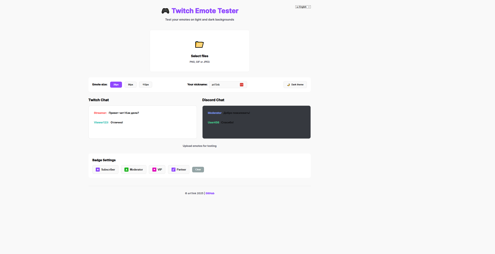
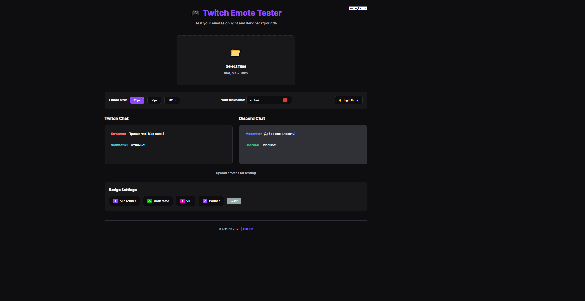
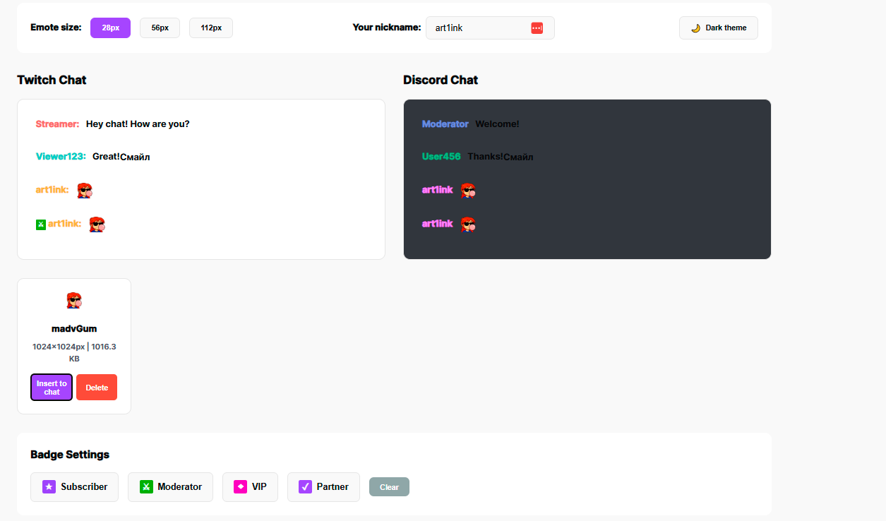

# 🎮 Twitch Emote Tester

A professional web tool for testing and previewing Twitch emotes on both light and dark backgrounds. Perfect for streamers, emote artists, and content creators who want to ensure their emotes look great in any chat environment.

[](https://opensource.org/licenses/MIT)
[](https://developer.mozilla.org/en-US/docs/Web/HTML)
[](https://developer.mozilla.org/en-US/docs/Web/CSS)
[](https://developer.mozilla.org/en-US/docs/Web/JavaScript)

## ✨ Features

### 🎨 **Dual Chat Preview**
- **Twitch Chat** - Test your emotes in a realistic Twitch environment
- **Discord Chat** - See how emotes appear in Discord
- Real-time preview with customizable chat messages

### 📏 **Multiple Size Testing**
- **28px** - Standard emote size
- **56px** - Medium size for better visibility
- **112px** - Large size for detailed inspection

### 🏷️ **Badge Integration**
- Test emotes with different Twitch badges:
  - ⭐ Subscriber
  - ⚔️ Moderator
  - 💎 VIP
  - ✓ Partner
- Visual feedback for selected badges
- Realistic badge display in chat preview

### 🌓 **Theme Support**
- Light theme for bright environments
- Dark theme for comfortable viewing
- Automatic theme persistence

### 🌍 **Multi-Language Support**
- English (default)
- Russian
- Easy to extend with additional languages

### 💾 **Smart Storage**
- Automatic save of uploaded emotes in browser
- Persistent settings (theme, language, emote size)
- No server required - all data stored locally

### 📱 **Responsive Design**
- Mobile-friendly interface
- Tablet-optimized layout
- Desktop-enhanced experience

## 🚀 Quick Start

### Installation

1. **Clone the repository**
```bash
git clone https://github.com/art1ink/twitch-emote-tester.git
cd twitch-emote-tester
```

2. **Open in browser**
```bash
# Simply open index.html in your web browser
# Or use a local server:
python -m http.server 8000
# Then navigate to http://localhost:8000
```

No build process or dependencies required! 🎉

## 📂 Project Structure

```
twitch-emote-tester/
├── index.html          # Main HTML file
├── css/
│   └── style.css      # All styling
├── js/
│   └── app.js         # Application logic
└── README.md          # Documentation
```

## 🎯 How to Use

1. **Upload Emotes**
   - Click "Select files" or drag & drop your emote files
   - Supports PNG, GIF, and JPEG formats

2. **Configure Settings**
   - Choose emote size (28px, 56px, or 112px)
   - Enter your nickname for personalized preview
   - Select a badge if desired

3. **Test in Chat**
   - Click "Insert to chat" to see your emote in action
   - View in both Twitch and Discord chat styles
   - Test with different backgrounds and themes

4. **Badge Testing**
   - Select a badge from Badge Settings
   - Your selected badge will appear with all future emote previews
   - Click "Clear" to reset chat and remove badge selection

## 🛠️ Technical Details

### Technologies Used
- **HTML5** - Semantic markup
- **CSS3** - Modern styling with CSS variables
- **Vanilla JavaScript** - No frameworks, pure JS
- **LocalStorage API** - Client-side data persistence
- **FileReader API** - Image file handling

### Browser Compatibility
- ✅ Chrome/Edge 90+
- ✅ Firefox 88+
- ✅ Safari 14+
- ✅ Opera 76+

### Features Implementation
- **Drag & Drop** - Native HTML5 Drag and Drop API
- **Image Processing** - FileReader for client-side image handling
- **Responsive Layout** - CSS Grid and Flexbox
- **Theme Switching** - CSS variables with JavaScript toggle
- **Internationalization** - JSON-based translation system

## 🎨 Customization

### Adding New Languages

Edit `js/app.js` and add your language to the `translations` object:

```javascript
const translations = {
    en: { /* English translations */ },
    ru: { /* Russian translations */ },
    es: { // Add Spanish
        title: 'Probador de Emotes de Twitch',
        subtitle: 'Prueba tus emotes en fondos claros y oscuros',
        // ... more translations
    }
};
```

### Customizing Colors

Modify CSS variables in `css/style.css`:

```css
:root {
    --twitch-purple: #9147ff;
    --accent-color: #00b8ff;
    /* Add your custom colors */
}
```

## 🤝 Contributing

Contributions are welcome! Here's how you can help:

1. Fork the repository
2. Create a feature branch (`git checkout -b feature/AmazingFeature`)
3. Commit your changes (`git commit -m 'Add some AmazingFeature'`)
4. Push to the branch (`git push origin feature/AmazingFeature`)
5. Open a Pull Request

### Ideas for Contributions
- [ ] Add more chat platform previews (YouTube, Kick, etc.)
- [ ] Implement emote animation testing
- [ ] Add export functionality for test results
- [ ] Create emote comparison view
- [ ] Add emote guidelines checker (size, format validation)

## 📝 License

This project is licensed under the MIT License - see the [LICENSE](LICENSE) file for details.

## 👨‍💻 Author

**art1ink**
- GitHub: [@art1ink](https://github.com/art1ink)

## 🙏 Acknowledgments

- Inspired by the Twitch streaming community
- Badge icons designed to match Twitch's visual style
- Thanks to all emote artists and streamers

## 📸 Screenshots

### Light Theme


### Dark Theme


### Badge Testing


---

⭐ **If you find this tool useful, please consider giving it a star!** ⭐

Made with 💜 by [art1ink](https://github.com/art1ink) | © 2025
